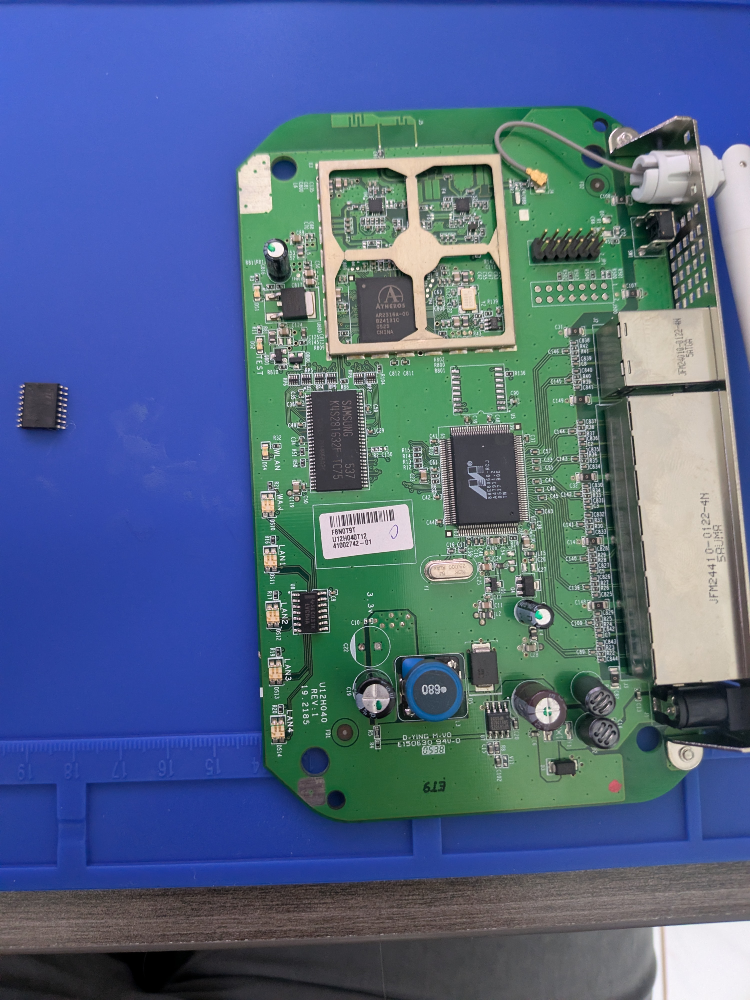
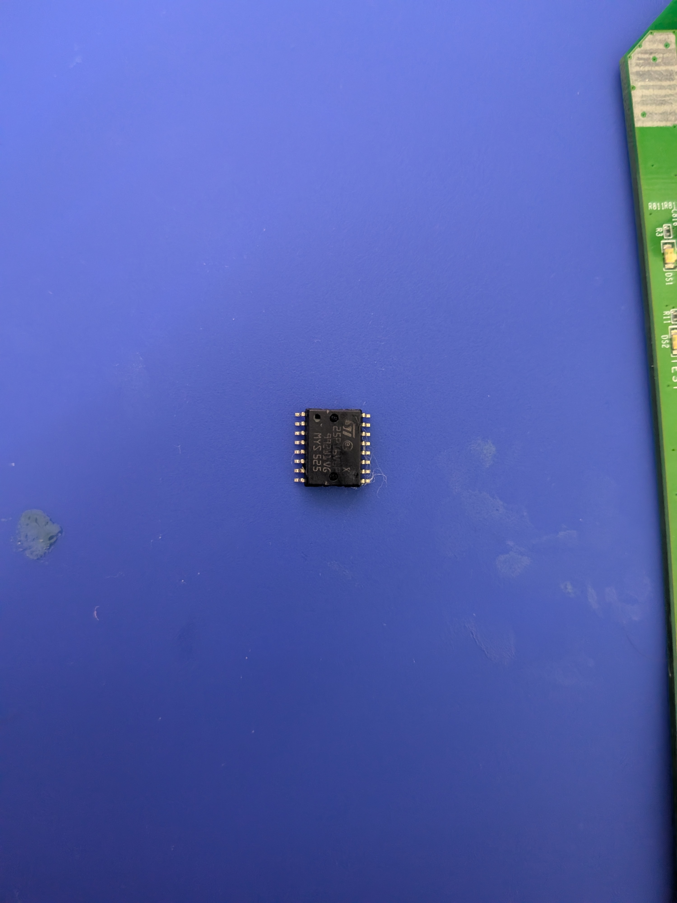
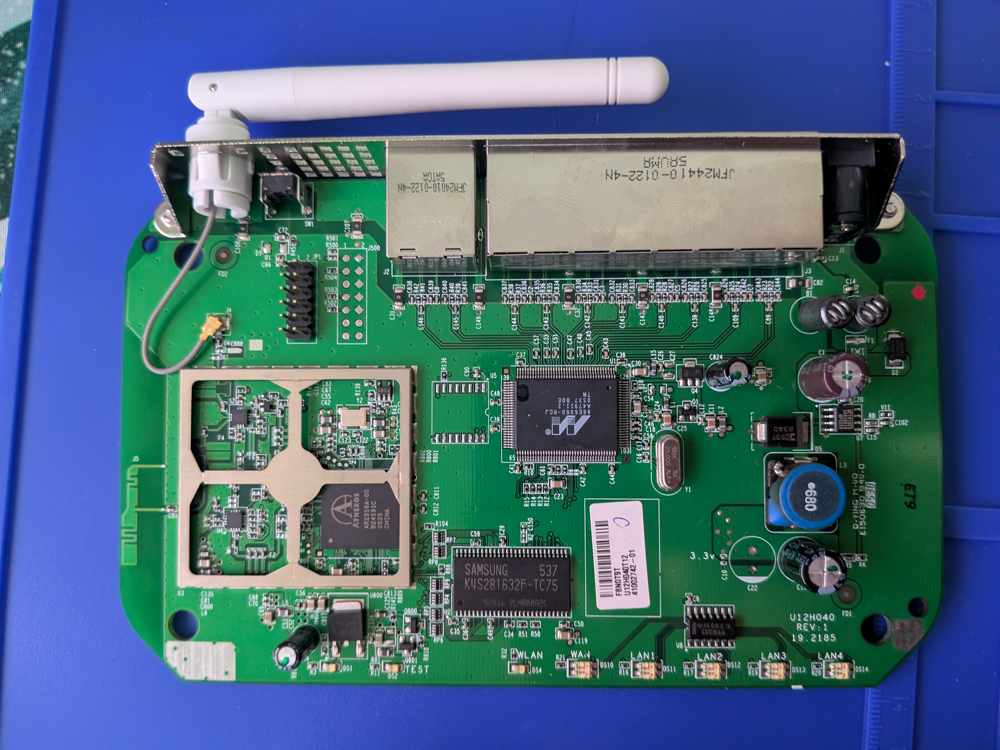
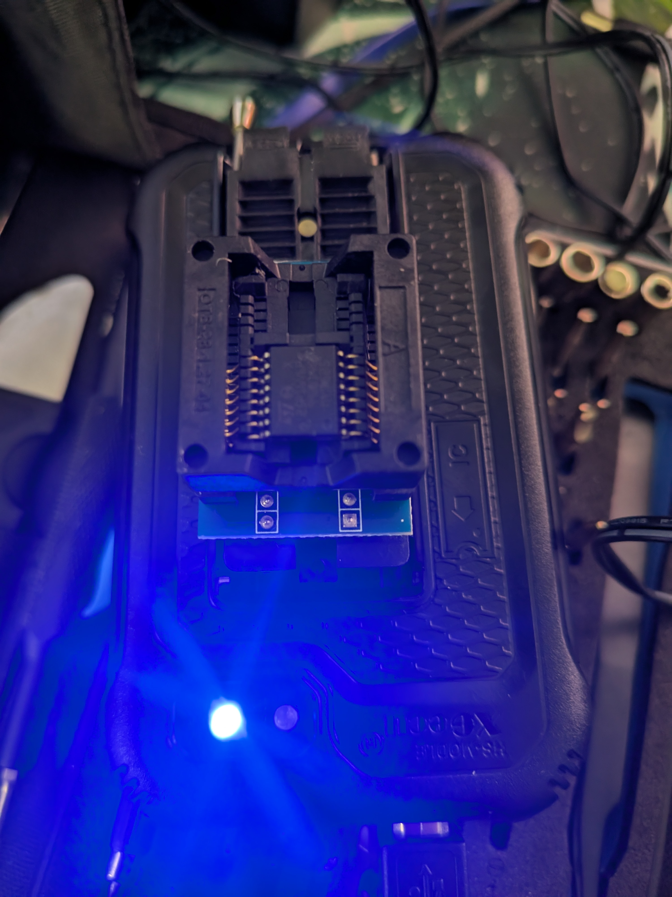
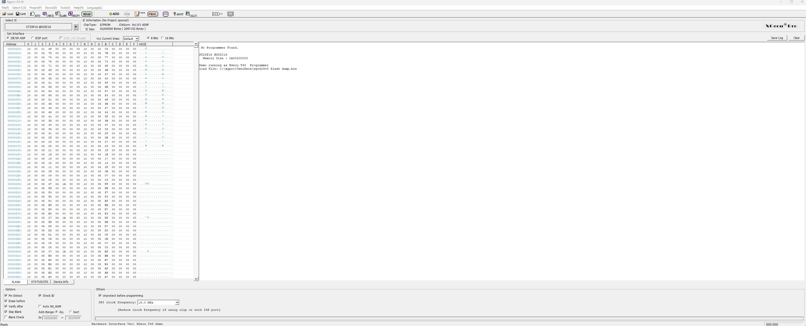
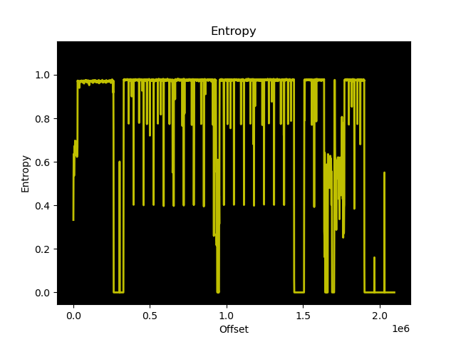
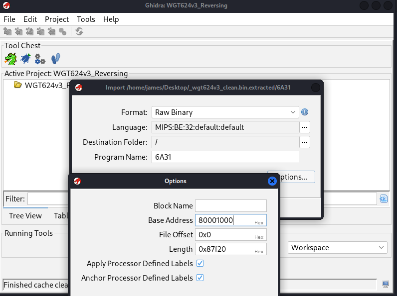
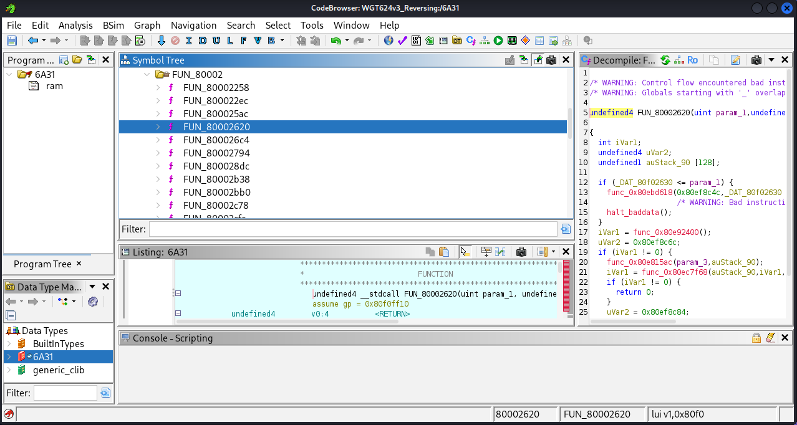

## netgear-wgt424v30-firmware-extraction
Hardware extraction, UART reconnaissance, and flash dump triage on a Netgear WGT624v3 router

## Table of Contents
* [Device Specifications and Overview](#device-specifications-and-overview)
* [Part 1: Device Disassembly and Testing](#part-1-device-disassembly-and-testing)
  * [1. Disassembly](#1-disassembly)
  * [2. Integrated Circuit Identification](#2-integrated-circuit-identification)
  * [3. UART Serial Reconnaissance](#3-uart-serial-reconnaissance)
    * [Step 1: Signal Probing](#step-1-signal-probing)
    * [Step 2: Hardware Serial Interfacing](#step-2-hardware-serial-interfacing)
    * [Step 3: Terminal Capture](#step-3-terminal-capture)
  * [4. Hot-Air Chip-Off Extraction](#4-hot-air-chip-off-extraction)
    * [Desoldering & Pad Cleaning Process](#desoldering--pad-cleaning-process)
  * [5. Flash Memory Acquisition (XGecu T48 & Xgpro)](#5-flash-memory-acquisition-xgecu-t48--xgpro)
    * [Hardware Programmer Interfacing](#hardware-programmer-interfacing)
    * [Software Readout & Acquisition](#software-readout--acquisition)
* [Part 2: Firmware Extraction & Static Analysis](#part-2-firmware-extraction--static-analysis)
  * [1. Flash Layout & Entropy Analysis](#1-flash-layout--entropy-analysis)
  * [2. Kernel Extraction](#2-kernel-extraction)
  * [3. Ghidra Setup & Architecture Configuration](#3-ghidra-setup--architecture-configuration)
  * [4. Disassembly & Decompilation](#4-disassembly--decompilation)
  

# Device Specifications and Overview
* Model: Netgear WGT624v3 
* FCC ID: PY3WGTY624V3
* IC ID: 4054A-WGT-624V3
* Board Revision: U12H040 REV:2 (PCB Date Code ~2005)


___


  
# Part 1: Device Dissassembly and Testing
  
## 1. Disassembly

1. Peeled back the four rubber feet on the bottom of the router and removed them to expose four Torx head screws.
2. Removed all 4 screws and shell comes apart in 3 pieces with no clips.
3. Lifted the green motherboard out of the chassis.
4. Carefully unclipped and removed the top metal RF sheild cover. 


___

## 2. Integrated Circuit Identification

1. System on Chip: Atheros AR2316A-00, BGA Chip, Single Chip MIPS32 Processor with integrated 802.11b/g MAC/baseband.
2. System Memory (RAM): Samsung K4S281632F-TC75, 54-pin TSOP-II, 128Mbit (16MB) SDRAM (133 MHz, CL3)
3. Flash Storage: STMicroelectronics 25P16V6P, 16-pin SOIC, 16Mbit (2MB) SPI NOR Flash memory, Holds the bootloader.
4. Ethernet Switch: Marvell 88E6060-RCJ, 128 pin PQFP, 6 Port Fast Ethernet switch controller.
5. Voltage Regulation: Richtek RT9164A, SOT-223, Linear low dropout (LDO)voltage regulator


## 3. UART Serial Reconnaissance

12-pin (2x6) through-hole header labeled **JP1** positioned between the RF shield and the Ethernet jacks. This multi-function header serves as the board's combined JTAG and UART diagnostic interface.


### Step 1: Signal Probing

Using a Klein Tools MM600 digital multimeter referenced against the chassis ground plane (Pin 11), individual pins on the JP1 header were mapped:

1. Pin 1 (3.3V VCC): Steady 3.3V DC logic high (Left disconnected to prevent back-powering the board).
2. Pin 9 (Router TX): Measured ~3.3V at idle, actively fluctuating down to ~2.8V–3.1V during boot as serial logs transmitted.
3. Pin 11 (GND): Measured 0V with direct continuity (0.2 Ω) to board ground shielding.


### Step 2: Hardware Serial Interfacing

Connected a CP2102 USB-to-UART bridge directly to the JP1 pin headers using Dupont jumper wires:
* **Adapter RXD** $\rightarrow$ **JP1 Pin 9 (Router TX)**
* **Adapter GND** $\rightarrow$ **JP1 Pin 11 (GND)**
* **Adapter TXD** $\rightarrow$ **Router RX**
* **VCC** left disconnected.


---

### Step 3: Terminal Capture

Serial capture was performed using 'picocom' on Linux

Connecting at standard 9600 baud (`picocom -b 9600 /dev/ttyUSB0`) and testing other non-standard rates produced severe framing errors and unreadable byte noise across the terminal buffer.

picocom -b 9600 /dev/ttyUSB0 


## 4. Hot-Air Chip-Off Extraction

Because serial UART access was limited to a one-way logging channel, physical flash extraction was used to acquire the raw firmware image directly.

### Desoldering & Pad Cleaning Process
1. Target Package: STMicroelectronics 25P16V6P (16-pin SOIC SPI NOR Flash).
2. Technique: Applied flux across both banks of 8 pins. Used a hot air rework station with circular airflow to heat all 16 leads evenly until solder liquified, lifted the chip vertically with tweezers to avoid damaging traces.
3. Footprint Preparation:Cleaned remaining solder from the 16 surface-mount pads using 99% isopropyl alcohol, checking no short circuits or solder bridges remained on the PCB.





---

## 5. Flash Memory Acquisition (XGecu T48 & Xgpro)

The extracted chip was read using an external hardware programmer to pull the complete flash memory buffer.

### Hardware Programmer Interfacing
* **Programmer:** XGecu T48 High-Speed Universal Programmer.
* **Socket Adapter:** SOP16/SOIC-16 to DIP ZIF (Zero Insertion Force) clamshell socket adapter.
* **Alignment:** Aligned Pin 1 (dot indicator on package) with the socket orientation markings and locked the clamshell retaining frame.



### Software Readout & Acquisition
* **Software:** Xgpro Programmer Suite.
* **Device Selected:** `ST [ST25P16 @SOIC16]` (Memory Size: `0x200000` bytes / 2,097,152 bytes).
* **Read Execution:** Read the entire SPI NOR flash memory array into the local software buffer and saved the raw binary dump to disk (`wgt624v3_flash_dump.bin`).



___

# Part 2: Firmware Extraction & Static Analysis

With a verified 2MB flash dump (`wgt624v3_clean.bin`), the next step was analyzing the flash layout, carving out the compressed operating system, and loading the kernel into Ghidra for static analysis.

---

## 1. Flash Layout & Entropy Analysis

To see how data was laid out across the physical flash chip, I generated an entropy graph of the full 2MB image:

```bash
binwalk -E wgt624v3_clean.bin
```



The graph shows three distinct regions:
* **`0x000000` – `0x006A30` (~0.33 to 0.65):** Uncompressed code and readable strings representing the router's bootloader.
* **`0x006A31` onward (~0.98):** A sharp vertical spike indicating compressed data where the main VxWorks operating system payload sits.
* **Drops to 0.0:** Empty padding areas between flash partitions containing repeated `0xFF` or `0x00` bytes.

---

## 2. Kernel Extraction

Scanning the flash image with `binwalk` identified the exact compression format and file offset:

```bash
binwalk wgt624v3_clean.bin
```

```text
DECIMAL       HEXADECIMAL     DESCRIPTION
--------------------------------------------------------------------------------
27185         0x6A31          Zlib compressed data, default compression
```

I extracted and decompressed the payload located at offset `0x6A31` (`27185` decimal):

```bash
binwalk -e wgt624v3_clean.bin
cd _wgt624v3_clean.bin.extracted/
ls -lh 6a31
```

This produced `6a31`, the uncompressed 32-bit MIPS kernel image (~556 KB).

---

## 3. Ghidra Setup & Architecture Configuration

Because `6a31` is a raw memory dump without file headers, I manually configured the architecture and memory layout during import:

* **Format:** Raw Binary
* **Language:** `MIPS:BE:32:default` (32-bit Big-Endian for the Atheros AR2316 SoC)
* **Base Address:** `80001000` (Standard MIPS RAM load address for VxWorks)



---

## 4. Disassembly & Decompilation

Once imported into Ghidra's CodeBrowser:

1. Jumped to the entry address `0x80001000`.
2. Disassembled the raw bytes into MIPS assembly instructions.
3. Ran the Auto-Analyzer with **MIPS Constant Reference Analyzer** and **Decompiler Parameter ID** enabled to resolve global pointers and populate the function tree.



Ghidra populated the symbol tree with identified functions and generated decompiled C code in the Decompiler window, displaying local stack buffers, variable assignments, and function dispatch logic.